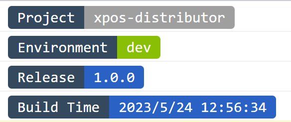

# vite-plugin-logs

[](https://www.npmjs.com/package/pkg-name)

A vite plugin for html inject logs

## Install

```bash

npm install vite-plugin-logs D

```

## Usage

```ts
import { defineConfig } from 'vite'

import logs, { preset } from 'vite-plugin-logs'

export default defineConfig(({ mode }) => {
  return {
    plugins: [
      logs(
        preset([
          { type: 'darkblue:gray', label: '..', value: '{_name_}' },
          { type: 'darkblue:green', label: '..', value: mode },
          { type: 'darkblue:blue', label: '..', value: '{_version_}' },
          { type: 'darkblue:blue', label: '..', value: '{_time_}' },
        ])
      ),
    ]
  }
})
```



## Custom
  
```ts
import { defineConfig } from 'vite'

export default defineConfig(({ mode }) => {
  return {
    plugins: [
      logs([
        [
          { text: 'Project', style: {/* ... */} },
          { text: ' {_NAME_} ', style: {/* ... */} },
        ],
        [
          { text: 'Environment', style: {/* ... */} },
          { text: ` ${mode} `, style: {/* ... */} },
        ],
        // ....
      ]),
    ]
  }
})
```

## License

[MIT](./LICENSE) License © 2023 [Hairyf](https://github.com/hairyf)
